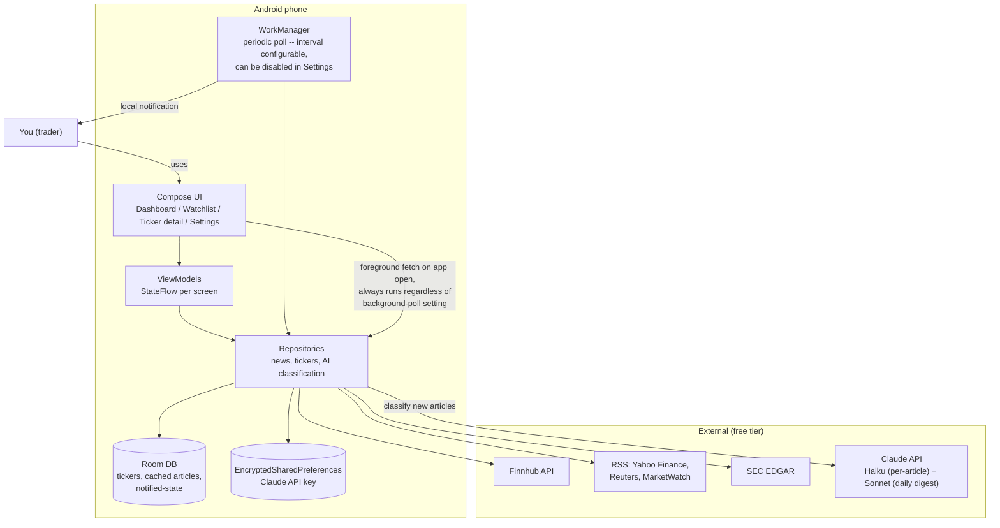

# Architecture

The structural counterpart to [README.md](../README.md)'s feature tour —
system context, data flow, the data-source comparison, and the phased
roadmap, plus the reasoning behind each decision. See
[CLAUDE.md](../CLAUDE.md) for the condensed "don't re-litigate this"
version.

## 1. System context

Fully on-device, single user, no backend server, no accounts.

**Background polling is a Settings-controlled feature, not a fixed
background job:** the interval defaults to 15 minutes (Android's own
floor for periodic `WorkManager` work) but is adjustable, and can be
turned off entirely — Settings enqueues or cancels the `WorkManager`
job rather than it running unconditionally from install. Separately,
opening the app always triggers an immediate foreground fetch through
the same repositories, bypassing `WorkManager` entirely, so the
dashboard is never stale on open even with background polling off.

News sources follow a small engine/registry pattern rather than one
fetcher with source-specific branches inside it — one class per source
(`FinnhubSource`, `RssSource`, `EdgarSource`) behind a shared interface,
looked up from a registry. This mirrors how `coding-adventure` (this
project's sibling repo, used as a structural reference) maps one
`ExecutionEngine` subclass per language behind `app/execution/registry.py`
— adding a data source later means adding one class, not editing a
shared fetcher's branches.

No server anywhere in the path — the periodic worker and the notification
it fires both happen on the same device, which is why "push notifications
matter" (a locked-in decision) didn't require standing up a push service.

## 2. Data-source comparison

Free tier, chosen for *latency* — the trap with "free news API" is that
several throttle or delay exactly the thing that matters for trading
relevance.

| Source | Gives you | Free tier | Use in alerting path? |
|---|---|---|---|
| Finnhub | Company news, basic financials | 60 calls/min | Yes — primary source |
| SEC EDGAR | 8-K, Form 4 filings | Unlimited | Yes — high-signal, low-noise |
| RSS (Google News, per-ticker search query) | Wire headlines per ticker | Unlimited | Yes — real-time, no key |
| Alpha Vantage | Built-in news sentiment score | 25 req/day | No — too limited to poll; reserve for on-demand deep dives |
| NewsAPI.org | Broad headline aggregation | 100 req/day | **No — 24h delay on free tier makes it useless for alerts.** Optional historical-context use only. |

The RSS row originally named Yahoo Finance/Reuters/MarketWatch specifically —
changed during Phase 2 implementation once it turned out none of the three
still reliably serves a public, per-ticker RSS feed (Reuters shut its public
RSS down entirely). Google News' per-query RSS
(`https://news.google.com/rss/search?q=<TICKER>+stock`) covers the same
"unlimited, no key" niche and actually returns results.

## 3. Claude integration

Two models, split by cost profile, not arbitrarily:

- **Haiku** — runs on every *new* article surfaced by the periodic worker
  (after de-dup against Room). Classifies urgency (hot/warm/calm), writes
  a one-line "why this might move the stock," and clusters near-duplicate
  stories from different outlets into one card.
- **Sonnet** — runs once a day (fixed 8:00 AM device-local time, no
  Settings picker) for the pre-market digest, where output quality
  across the whole watchlist matters more than per-call cost. Covers
  only hot/warm articles from the last 24h; silently skipped (no Sonnet
  call, no notification) on a day with nothing notable. Off by default.

The API key is entered once in Settings, stored in
`EncryptedSharedPreferences` (backed by the Android Keystore), and never
leaves the device except in direct API calls to `api.anthropic.com`.
Subscription-based auth (reusing a Claude.ai login) was considered and
rejected — not a supported third-party integration path.

## 4. Phased roadmap

Each phase ships something actually usable, not just a milestone.

1. **Project scaffold** — Kotlin/Compose project, package structure, Room
   schema (`Ticker`, `Article`, `Source`), bottom nav
   (Dashboard/Watchlist/Settings).
2. **Watchlist, no news yet** — add/remove/search tickers, dashboard
   renders tracked tickers as empty-state cards. **Later addition:** Add
   Ticker autocompletes symbol/company name as you type, via Finnhub's
   `/search` endpoint (`TickerSymbolSearch`, debounced 300ms); silently
   shows no suggestions without a Finnhub key rather than erroring.
   **Later addition:** a mandatory first-launch profile screen
   (`ProfileOnboardingScreen`) collects name and email before any other
   screen is reachable — the same fields Settings' "Your info" section
   already stored for the EDGAR User-Agent (§3), now required up front
   instead of optional. An "Import setup instead" shortcut on that screen
   satisfies the gate from a restored backup without retyping.
3. **Live news feed** — Finnhub + RSS ingestion into Room, ticker-detail
   feed with clickable source links, manual refresh.
4. **Background alerts** — WorkManager periodic poll + diffing against
   already-seen articles, local notifications with per-ticker mute.
5. **Claude comes online** — API key settings screen, per-article urgency
   badge + "why it matters," dedup clustering. Shipped: urgency badge +
   why-it-matters, via one batched Haiku call per ticker per refresh.
   **Shipped: dedup clustering** — the same Haiku classification call also
   returns an optional `cluster` integer per article; `NewsRepository`
   resolves each batch's local integers into a stable `clusterId` string
   (the first article id seen for that integer becomes canonical, no
   UUIDs needed). Scope is deliberately **per classification batch only**
   — a ticker's ≤20 unclassified articles in one refresh — so a duplicate
   arriving in a later batch never retroactively clusters with something
   already classified; there's no cross-batch comparison. Clustering
   collapses more than just the ticker-detail card: `collapseClusters()`
   is also applied before notifications (`NewsPollRunner` shows one
   notification per story, but still calls `markNotified` with every
   cluster member so an unshown sibling can't resurface alone on a later
   poll) and before the digest prompt (`DigestRunner`), so a
   multi-outlet story notifies and digests once, not once per outlet.
   Ticker detail groups clustered articles into one card (earliest
   article as the primary headline, others listed as a tappable "Also:
   outlet · outlet" line) via `ui/tickerdetail/ArticleGroup.kt`.
6. **Trading-specific depth** — SEC filings feed, earnings-calendar-aware
   alert sensitivity, pre-market digest notification, home-screen widget.
   **Shipped: the SEC filings feed** — `EdgarSource` is just another
   `NewsSource` (see §1's registry pattern), so filings flow through the
   existing Room table, classifier, notifications, and UI unchanged.
   **Shipped: earnings-calendar-aware alert sensitivity** — while wiring
   this up it turned out notifications had no urgency gate at all (any
   fresh article notified, not just "flagged urgent" as this doc always
   said), so that baseline gate was added at the same time: only `hot`
   notifies by default, and `warm` also notifies within ±1 day of a
   ticker's earnings date (via Finnhub's earnings-calendar endpoint, same
   key as company news).
   **Shipped: the pre-market digest** — `DigestWorker`, a second
   independent `WorkManager` job (combined with the news poll worker via
   `DelegatingWorkerFactory`), fires at a fixed 8:00 AM device-local time
   and asks Sonnet for a short summary of the whole watchlist's hot/warm
   news from the last 24h; skipped entirely when nothing's notable. Off
   by default.
   **Shipped: the home-screen widget** — built with Jetpack Glance
   (`androidx.glance:glance-appwidget`), mirroring the Dashboard's
   symbol + urgency badge per ticker. Unlike notifications (which
   deliberately don't deep-link, §1), tapping a widget row jumps straight
   to that ticker's detail screen — a widget tap always freshly
   recreates `MainActivity` (no `onNewIntent` re-entrancy to worry
   about), so the deep-link mechanism this needed doesn't carry the risk
   that made notifications skip it. `NewsRepository.refresh()` requests a
   widget update at the end of every refresh, keeping it in sync without
   a separate call site anywhere. All four pieces of this phase are now
   built, and with item 5's dedup clustering also shipped, every phase on
   this roadmap is now built.

## 5. Stretch ideas (not scheduled)

- Sentiment-vs-price overlay chart.
- Unusual options activity / large block trades layered alongside news.
- Backtest-lite: log every AI call vs. next-day price move to judge
  signal quality over time.
- Social sentiment (Reddit/StockTwits), clearly labeled lower-confidence
  than wire news.

## 6. Risks worth remembering

- **Not financial advice** — urgency scores are a triage aid; the app
  should surface uncertainty rather than false confidence.
- **Free-tier ceilings** — Finnhub's 60 calls/min comfortably covers a
  watchlist of a few dozen tickers; a much larger list may need a longer
  poll interval or a paid tier.
- **Estimated running cost** — $0 in data fees at free tier; Claude Haiku
  classification at modest daily article volume runs to roughly a few
  cents/day, Sonnet's daily digest adds a similar amount.
